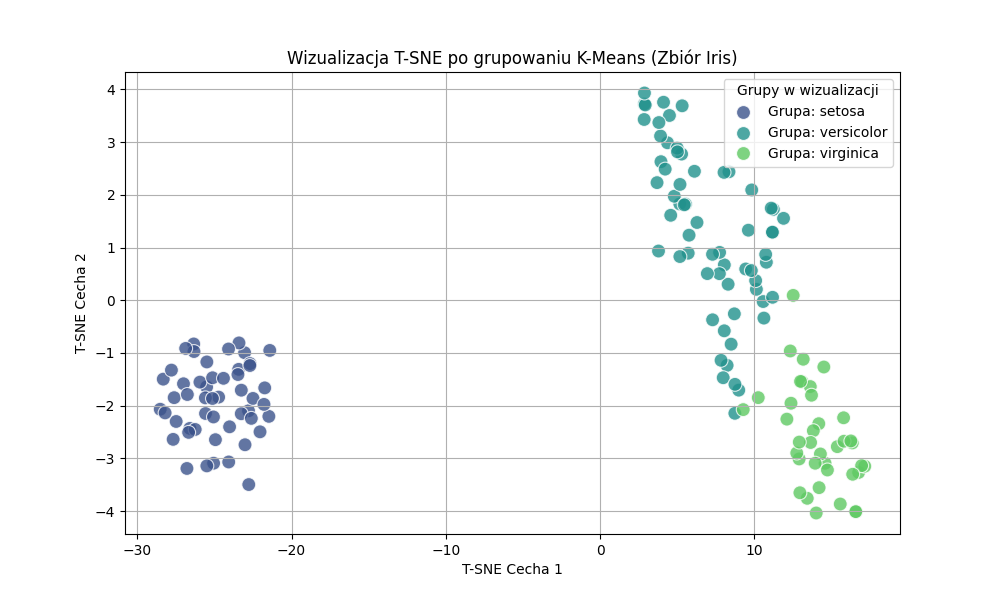
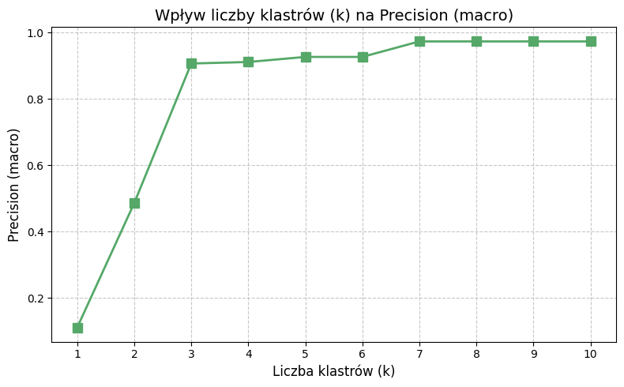
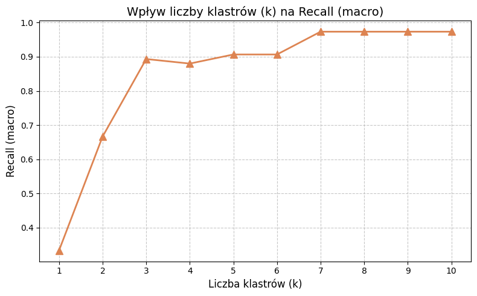
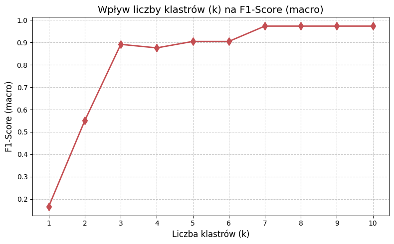

# [cite_start]Sprawozdanie nr. 1 - Przegląd metod i narzędzi AI

[cite_start]**Imię i nazwisko:** Mateusz Mioduszewski
[cite_start]**Numer indeksu:** [WPISZ TWÓJ NIEPARZYSTY NUMER INDEKSU]
[cite_start]**Grupa:** Ps4

## [cite_start]1. Krótka analiza danych (EDA) 
[cite_start]Zbiór danych Iris składa się ze 150 próbek kwiatów irysa. Każda próbka opisana jest za pomocą 4 atrybutów numerycznych: 

**Wnioski z analizy wizualnej:**
* Wykres macierzowy dobitnie ukazuje, że klasa *Setosa* jest liniowo separowalna od dwóch pozostałych klas pod względem niemal każdej z par cech. Największą zdolność dyskryminacyjną posiadają cechy płatka (petal length oraz petal width).
* Rozkłady gęstości (KDE) na przekątnej wykresu potwierdzają, że próbki należące do gatunku *Setosa* tworzą wąskie, mocno skoncentrowane i odizolowane dystrybucje.
* Gatunki *Versicolor* oraz *Virginica* wykazują znaczne nachodzenie na siebie (tzw. overlap) w przestrzeni cech. [cite_start]Sugeruje to, że algorytmy grupowania opierające się na odległości euklidesowej (takie jak K-Means) nie będą w stanie idealnie rozdzielić tych dwóch grup, co z pewnością przełoży się na niższe wyniki metryk dla tych konkretnych klas[cite: 9].

## [cite_start]2. Grupowanie przy użyciu algorytmu K-Means i wizualizacja T-SNE [cite: 9, 14]
[cite_start]Zgodnie z poleceniem dla Grupy 2, przeprowadzono grupowanie przy użyciu algorytmu K-Means[cite: 8, 9]. [cite_start]Do redukcji wymiarowości i wizualizacji wyników w przestrzeni 2D wykorzystano algorytm T-SNE[cite: 14].

**Wnioski z wizualizacji T-SNE:**
* [cite_start]Algorytm T-SNE z sukcesem zredukował 4-wymiarową przestrzeń cech do 2 wymiarów w postaci wykresu 2D[cite: 14].
* Na wykresie wyraźnie widać jedną, całkowicie odizolowaną "wyspę" punktów, która perfekcyjnie pokrywa się z wyodrębnionym klastrem odpowiadającym gatunkowi *Setosa*.
* Dwa pozostałe klastry leżą w bezpośrednim sąsiedztwie i miejscami się przenikają. [cite_start]Wizualizacja T-SNE potwierdza wcześniejsze obserwacje z analizy eksploracyjnej – granica decyzyjna między *Versicolor* a *Virginica* jest rozmyta, co stanowi główne wyzwanie dla nienadzorowanego algorytmu K-Means[cite: 9, 14].

## [cite_start]3. Metryki oceny modelu [cite: 13]
[cite_start]Ponieważ algorytm K-Means jest metodą uczenia nienadzorowanego[cite: 9], obliczenie klasycznych metryk klasyfikacyjnych wymagało zmapowania wyznaczonych klastrów na dominantę rzeczywistych etykiet wewnątrz każdej grupy. [cite_start]Przeanalizowano metryki takie jak accuracy, precision, recall czy f1-score[cite: 13].

**Wnioski z analizy metryk oceny modelu:**
* [cite_start]**Accuracy (Dokładność):** Całkowita dokładność modelu wynosi około 89% dla domyślnego podziału na 3 gatunki[cite: 13]. [cite_start]Wynik ten dowodzi, że K-Means bardzo dobrze radzi sobie z odtworzeniem naturalnych podziałów gatunkowych zbioru Iris, pomimo braku dostępu do etykiet podczas trenowania[cite: 9]. Błędy wynikają wyłącznie z pomyłek między dwoma podobnymi do siebie gatunkami.
* [cite_start]**Precision (Precyzja):** Precyzja dla klastra odpowiadającego *Setosie* wynosi 1.0 (100%), co oznacza, że żaden inny kwiat nie został błędnie przypisany do tej grupy[cite: 13]. [cite_start]Precyzja spada dla *Virginici* i *Versicolor*, co wynika z geometrycznej specyfiki K-Means[cite: 9].
* [cite_start]**Recall (Czułość):** Czułość na poziomie 1.0 dla *Setosy* potwierdza, że algorytm odnalazł wszystkie próbki tej klasy i umieścił je w jednym klastrze[cite: 13]. Czułość dla dwóch pozostałych klas jest niższa – algorytm "gubi" próbki brzegowe, przypisując kwiaty *Versicolor* do klastra zdominowanego przez *Virginicę* (i odwrotnie).
* [cite_start]**F1-Score:** Jako średnia harmoniczna precyzji i czułości, F1-Score stanowi najlepsze podsumowanie jakości grupowania w przypadku nachodzących na siebie klas[cite: 13]. [cite_start]Perfekcyjny wynik dla *Setosy* oraz wyniki w przedziale 75-85% dla pozostałych gatunków ostatecznie udowadniają, że K-Means prawidłowo rozpoznaje ogólne struktury w zbiorze Iris, ale ma matematyczne ograniczenia w precyzyjnym cięciu przestrzeni na granicach blisko spokrewnionych klas[cite: 9].