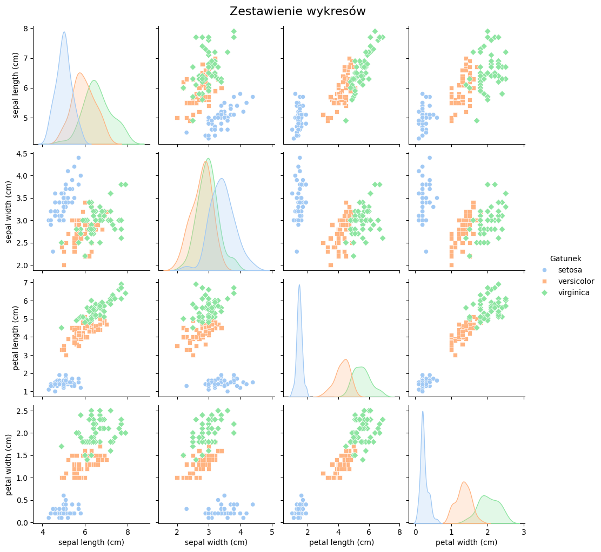
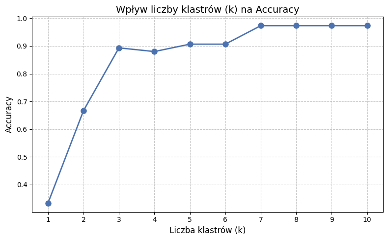

# Sprawozdanie, Przegląd metod i narzędzi AI

**Imię i nazwisko:** Mateusz Mioduszewski  
**Indeks:** 119159  
**Grupa:** Ps4, Data Science, II semestr

## 1. Krótka analiza danych (EDA)

Zbiór danych Iris składa się ze 150 próbek kwiatów irysa. Każda próbka opisana jest za pomocą 4 atrybutów numerycznych (sepal length, sepal width, petal length i petal width)

**Wnioski:**
* Wykres macierzowy przedstawia, iż *Setosa* jest odseparowana od *Versicolor* i *Virginica* w każdej parze cech. Największa różnica jest w cechach płatka (petal length oraz petal width).
* Rozkłady gęstości (KDE) na przekątnej pokazują, że próbki *Setosy* są mocno skupione w jednym miejscu
* *Versicolor* i *Virginica* mocno na siebie nachodzą w przestrzeni cech, przez co K-Means ma wyraźny problem z ich rozdzieleniem. To powoduje ciągniecie w dół wyników metryk dla tych dwóch klas.

## 2. Grupowanie przy użyciu algorytmu K-Means i wizualizacja T-SNE
Zgodnie z zadaniem dokonano grupowania przy  użyciu algorytmu K-Means. Do redukcji wymiarowości i wizualizacji wyników w przestrzeni 2D wykorzystano algorytm T-SNE.

**Wnioski z wizualizacji T-SNE:**
* Algorytm T-SNE z sukcesem zredukował 4-wymiarową przestrzeń cech do 2 wymiarów w postaci wykresu 2D.
* Na wykresie wyraźnie widać jedną, całkowicie odizolowaną "wyspę" punktów, która dobrze pokrywa się z wyodrębnionym klastrem odpowiadającym gatunkowi *Setosa*.
* Dwa pozostałe klastry leżą w bezpośrednim sąsiedztwie i miejscami się przenikają. Granica decyzyjna między *Versicolor* a *Virginica* jest rozmyta, co stanowi wyzwanie dla nienadzorowanego algorytmu K-Means.

## 3. Metryki oceny modelu

Ponieważ algorytm K-Means jest metodą uczenia nienadzorowanego, obliczenie klasycznych metryk klasyfikacyjnych wymagało zmapowania wyznaczonych klastrów na dominantę rzeczywistych etykiet wewnątrz każdej grupy. Przeanalizowano metryki takie jak accuracy, precision, recall czy f1-score.

**Wnioski z analizy metryk oceny modelu:**
* **Accuracy:** Całkowita dokładność modelu wynosi około 89% dla domyślnego podziału na 3 gatunki. Wynik ten dowodzi, że K-Means bardzo dobrze radzi sobie z odtworzeniem naturalnych podziałów gatunkowych zbioru Iris, pomimo braku dostępu do etykiet podczas trenowania. Błędy wynikają z pomyłek między dwoma podobnymi do siebie gatunkami.
* **Precision:** Precyzja dla klastra odpowiadającego *Setosie* wynosi 1.0 (100%), co oznacza, że żaden inny kwiat nie został błędnie przypisany do tej grupy. Precyzja spada dla *Virginici* i *Versicolor*, co wynika z geometrycznej specyfiki K-Means.
* **Recall:** Czułość na poziomie 1.0 dla *Setosy* potwierdza, że algorytm odnalazł wszystkie próbki tej klasy i umieścił je w jednym klastrze. Czułość dla dwóch pozostałych klas jest niższa, ponieważ algorytm na swój sposób "gubi" próbki brzegowe, przypisując kwiaty *Versicolor* do klastra zdominowanego przez *Virginica* (i odwrotnie).
* **F1-Score:** Jako średnia harmoniczna precyzji i czułości, F1-Score stanowi najlepsze podsumowanie jakości grupowania w przypadku nachodzących na siebie klas. Perfekcyjny wynik dla *Setosy* oraz wyniki w przedziale 75-85% dla pozostałych gatunków ostatecznie udowadniają, że K-Means prawidłowo rozpoznaje ogólne struktury w zbiorze Iris, ale ma matematyczne ograniczenia w precyzyjnym cięciu przestrzeni na granicach blisko spokrewnionych klas.

## Podsumowanie

Analiza zbioru danych Iris z użyciem K-Means i wizualizacji T-SNE pokazała, że metody nienadzorowane całkiem dobrze odnajdują naturalne struktury gatunkowe w danych. Gatunek *Setosa* nie sprawia żadnych problemów – jest łatwo separowalny i uzyskuje idealne wyniki we wszystkich metrykach. Problemy pojawiaja się przy rozróżnieniu *Versicolor* i *Virginica*, które nakładają się na siebie w przestrzeni cech i tym samym zmniejszają skuteczność K-Means. Aczkolwiek ogólna dokładność na poziomie około 89% jest akceptowalna.